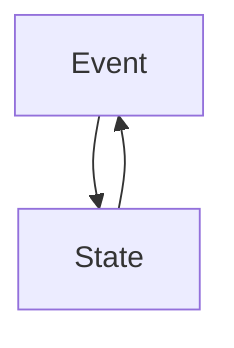
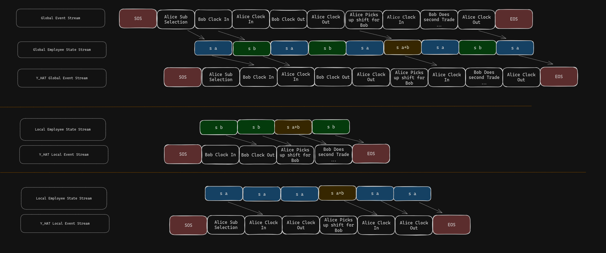
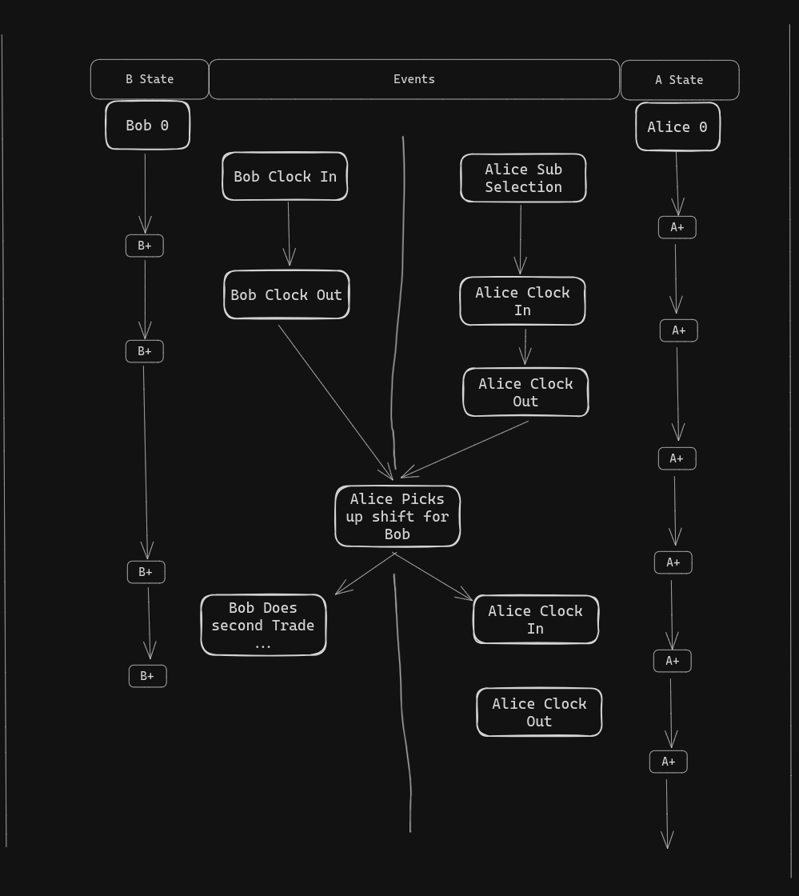

## Definitions
### State
The representation of the thing or person at a particular point in time.

### Event
Something that occurs, which is used to update our understanding of state.

## Motivation
The primary modality that each TC+ product operates on is people and events.

These two ideas are interlinked, so modeling should represent how we understand people and events.

Many predictions we try to make are based on these events, such as how many hours will Bob work this month.
Some events we track:
- Punch In 
- Punch Out 
- Scheduled time

Other predictions are related to the people producing the event, who is the best candidate for sub search.

## Practical applications
### Sub Search
We can extract the state of `Alice` and `Bob` for the current point in time and store it in a searchable database.
Let's propose a query `I need a sub to teach calc 2`, we can search for candidates whose state matches closely to the query.

### Anomaly Detection
Now that we have a representation fo `Alice` and `Bob`, we can compare the "histogram" of their progression over time to other's.
This reveals the common behavior of potential fraudsters. 
Potentially better yet, we have an "exchange" for training a downstream model to identify fraudsters for us.

## Extra reading
- https://en.wikipedia.org/wiki/Attention_(machine_learning)

- https://en.wikipedia.org/wiki/Hidden_Markov_model

 