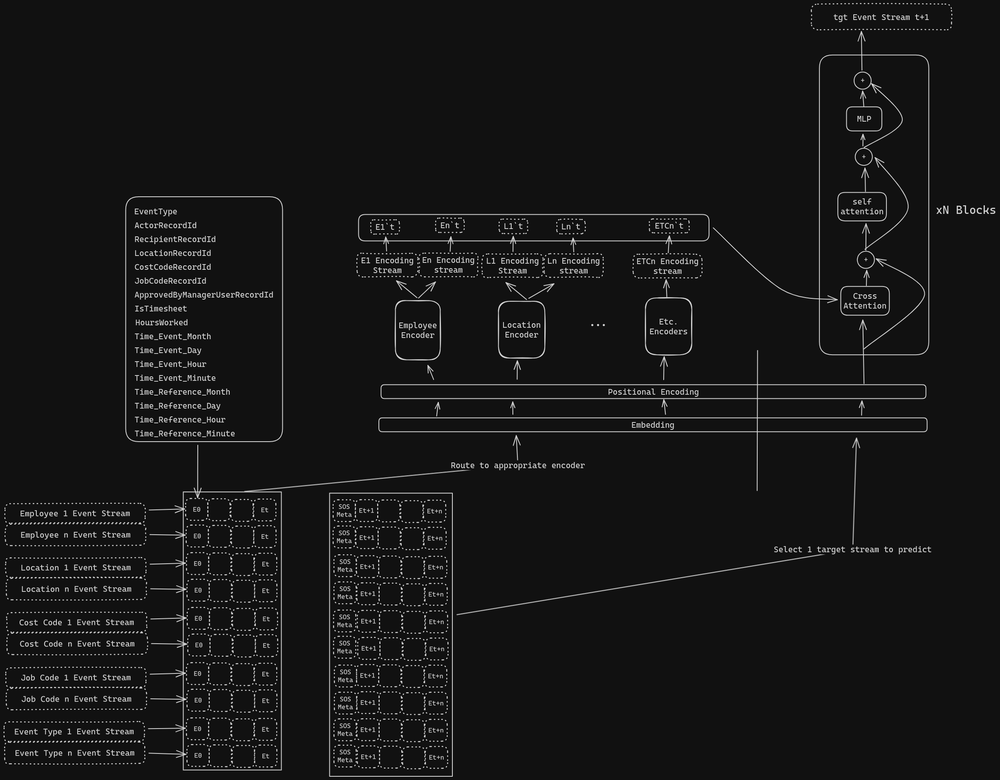

# Intro
Your challenge is to build this model architecture.
When you are done you should be able to explain some of what you learned and the intent.

## General Parameters
- Must be trainable by starting the docker containers.
- Demonstrate your understanding of pytorch and model construction.

### Additional Guidance
- The encoders layer on the diagram should be transformer encoders.
- Only the last vector may be passed from each encoder to the cross-attention.

---
## On Completion Questions
These are questions for you to answer, not to build.

### What is the meaning of the outputs from the encoder streams?

### What are some improvements you may make to this model?

### How would you conduct a beam search using this model? How would the model need to change?

### Why would you conduct a beam search?

### How would you convert this model's decoder layer into a diffusion model?

### How would this model behave differently if this is a diffusion model?
